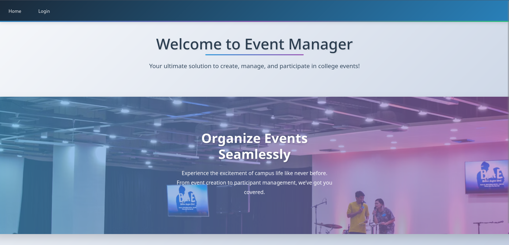
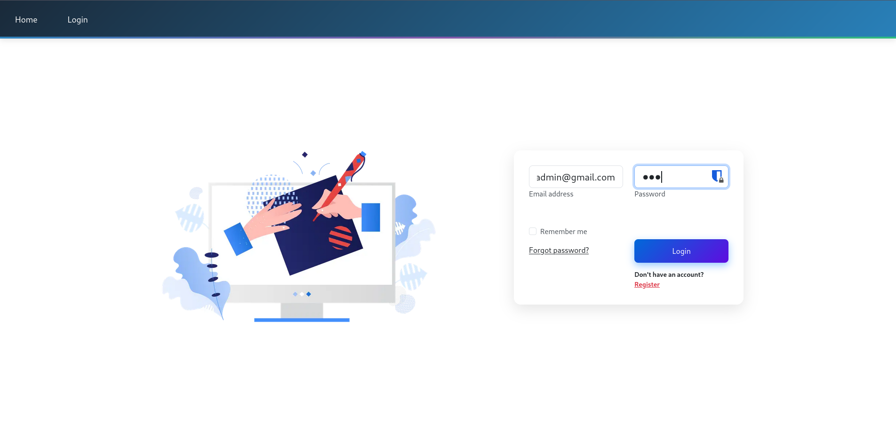
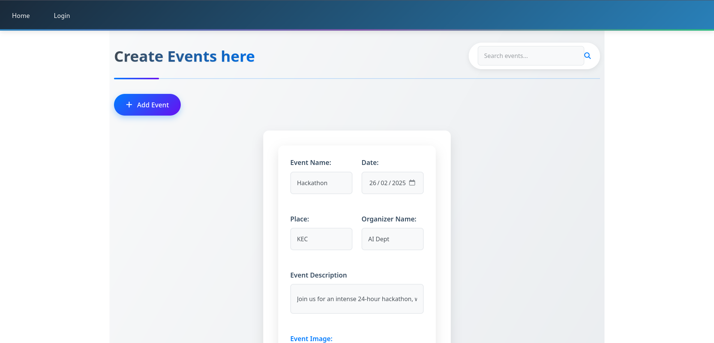
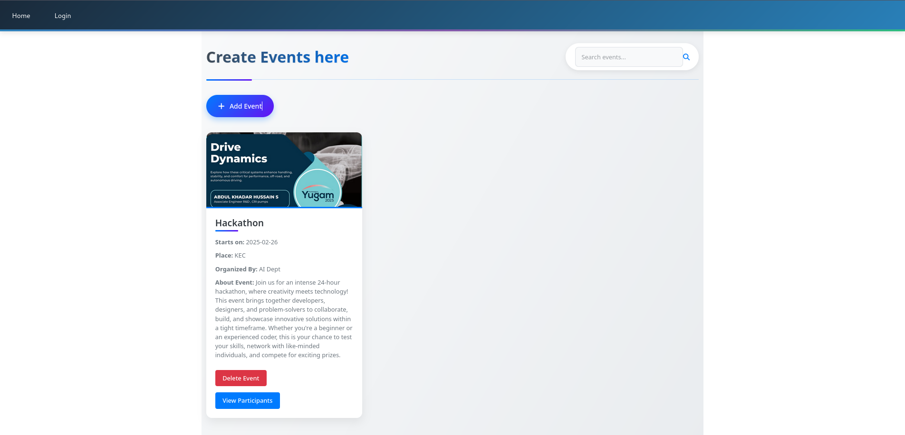
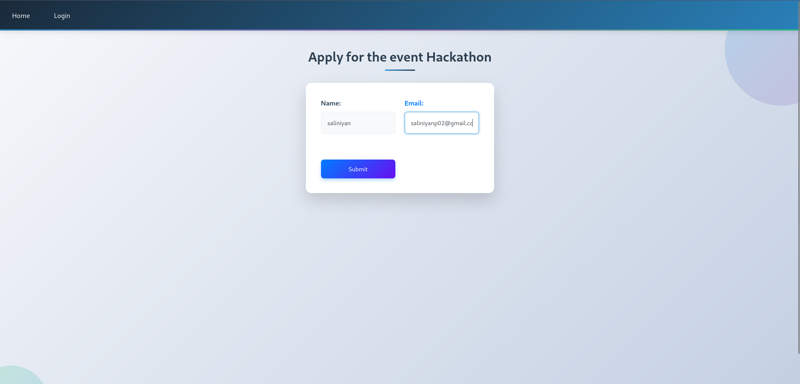
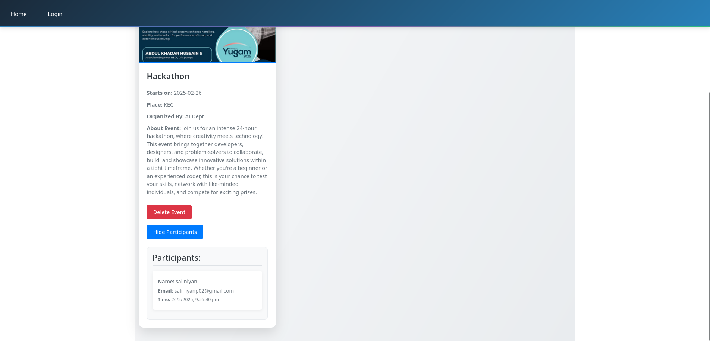

# Event Manager

## Overview  
Event Manager is a web-based application designed to streamline event creation, management, and participation. It provides a seamless experience for both event organizers and attendees, enabling efficient event coordination.

## Features  
### Admin  
- Create and delete events  
- View participant details along with submission time
- Search for a event using search box
### Student  
- View available events
- Apply for events

## Tech Stack  
- **Frontend:** React.js  
- **Backend:** Node.js  
- **Database:** MongoDB

## Run the project
   1. Create a `.env` file inside the `server` folder and add the MongoDB connection URL:  
   MONGODB_URI=your_mongodb_connection_url to connect with mongoDB
   2. Start the server:  
   ```sh
   cd server
   node server.js
   ```
   3. Run the frontend:
   ```
   cd client
   npm start
   ```

## Screenshots

### Home page


### Login page


### Event creation in Admin page


### Admin page


### Student page


### Apply for event


### View participants in admin page



